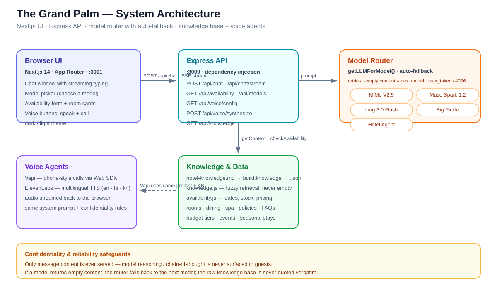
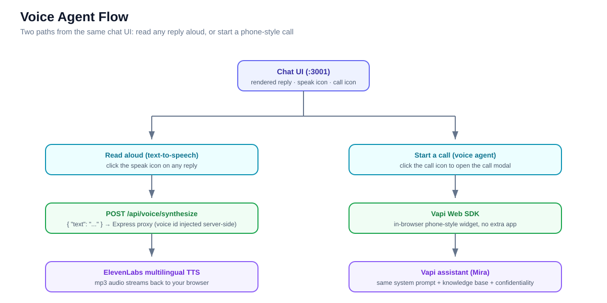

# The Grand Palm — Hotel Guest Assistant

## What is this? (plain English)

This is a **hotel guest assistant** project. It gives hotel guests a friendly AI concierge called **Mira** that they can chat with on the website — or **call and talk to out loud** on a phone-style voice call.

Guests can ask Mira anything about the hotel:

- *"Is anything available tonight for 2 people?"* — she checks real room availability and shows prices.
- *"What time is checkout?"* — she answers from the hotel handbook.
- *"cheap room, near the pool"* — she finds a matching room.

The voice feature is built-in — click the call icon on the website and you can speak to Mira naturally, just like calling the front desk. You can also tap the speaker icon on any reply to hear it read aloud.

---

## Features

- **Agentic chat** — Mira handles *any* question: typos ("mombers", "rooom"), compound requests ("room for 5 with spa on 29/oct"), budget phrasing ("cheap room", "high budget"), and mixed languages (replies in Hindi/Telugu/Kannada/…). No regex intent-gates, no hardcoded question patches.
- **Multi-model with auto-fallback** — a live model picker in the UI; if the selected model fails, the backend silently tries the other models, with **Hotel Agent** as the final fallback.
- **Knowledge-base confidentiality** — the system prompt (chat + Vapi voice) forbids exposing the raw dataset, internal section names, system instructions, or any reasoning. If a guest asks about the "knowledge base", Mira warmly redirects to what she can help with.
- **Deterministic availability** — natural-language dates ("tonight", "March 15 2026", "20/sep/2026 for 6") with correct per-night/total pricing; identical dates always return identical results.
- **Voice** — listen to any reply via ElevenLabs TTS (en/hi/kn); start a real phone-style call via Vapi.
- **Polish** — dark/light theme, streaming typing indicator, structured markdown replies with bold room names/prices, rotating welcome questions.
- **Tested** — 31 offline unit + API tests (LLM/TTS mocked, deterministic).

---

## Quick start

```bash
# 1. install backend + frontend
npm install
npm install --prefix web

# 2. configure secrets
cp .env.example .env          # add your keys (see table below)

# 3. (re)build the knowledge base from Markdown
npm run build:knowledge

# 4. (optional) create the Vapi phone assistant
npm run create:vapi           # prints an assistant id -> paste into .env as VAPI_ASSISTANT_ID

# 5. run everything (API :3000 + Next.js :3001)
npm run dev
```

Open:

- Web app: **https://hotel-assistant-theta.vercel.app/**
- API health: **https://hotel-assistant-theta.vercel.app/api/health**
- Tests: `npm test`

> `.env` and `web/.env.local` are git-ignored and contain real keys — never commit them.

### Environment variables (`.env`)

| Key | Purpose | Default |
| --- | --- | --- |
| `PRIMARY_API_KEY` | Fallback model key (optional) | *(empty — works out of the box)* |
| `PRIMARY_BASE_URL` | OpenAI-compatible endpoint for the fallback model | *(built-in default)* |
| `PRIMARY_MODEL` | Fallback model name | *(built-in default)* |
| `ELEVENLABS_API_KEY` | Text-to-speech (read-aloud button) | *(optional for chat-only use)* |
| `ELEVENLABS_VOICE_ID` | TTS voice | `EXAVITQu4vr4xnSDxMaL` |
| `VAPI_PRIVATE_API_KEY` | Server-only — creating the phone assistant | *(optional)* |
| `VAPI_PUBLIC_API_KEY` | Served to the browser via `/api/voice/config` | *(optional)* |
| `VAPI_ASSISTANT_ID` | The created Vapi assistant | *(optional)* |
| `PORT` | API port | `3000` |

> The built-in fallback endpoint/model are set in `src/ai/providers.js` and `src/ai/llm.js` — you only need the `PRIMARY_*` variables to override them with your own account.

### Usable without any key

The chat + availability experience runs entirely on the built-in models (**MiMo V2.5**, **Muse Spark 1.2**, **Ling 3.0 Flash**, **Big Pickle**) with a zero-config fallback to **Hotel Agent**, so the app is fully functional before you add any optional keys.

---

## Architecture



### Data flow — one full chat turn

1. **Frontend** sends `{ message, history, model }` to `POST /api/chat` (or the SSE `/stream` variant, proxied by Next.js).
2. **Context retrieval** — `knowledge.getContext(message)` fuzzy-ranks KB units (rooms, dining, spa, policies, FAQs, budget tiers…) by token overlap + Levenshtein similarity. Search **never returns empty**.
3. **Availability extraction** — always attempted: `availability.extractRequest()` pulls dates/guests; `checkAvailability()` computes deterministic stock + pricing. No intent gate decides whether data "should" be injected — the AI gets what it needs and decides.
4. **Prompt assembly** — system prompt (Mira persona: personality + 15 rules incl. formatting/confidentiality) + knowledge block + availability block + capped history + user message.
5. **Model routing** — `getLLMForModel(modelId)` builds a fallback chain starting with **Ling 3.0 Flash** (the default) → selected model → other models → **Hotel Agent**. Each model is retried up to 3x; responses with empty `content` (never `reasoning`) trigger the next model. `max_tokens` defaults to 4096.
6. **Reply** — `{ reply, intent, sources, availability, fallback }`; `/stream` emits SSE chunks + a `done` frame. If every model fails, a deterministic KB/availability reply with `fallback: true` keeps the assistant alive.

---

## Voice agent



The same browser chat drives **two voice experiences** with zero extra apps:

- **Read any reply aloud** — every AI message gets a speaker icon. Click it and Mira reads the answer out loud in the guest's language (English, Hindi, or Kannada).
- **Start a phone-style call** — click the call icon and a voice modal opens. You can ask Mira anything out loud, just like typing a message. For example:
  - *"What time is checkout?"*
  - *"Do you have a spa?"*
  - *"Is anything available tonight for 2 people?"*
  - *"What's the cheapest room you have?"*

**Endpoints:** `GET /api/voice/config` (public key + assistant id for the browser) and `POST /api/voice/synthesize` (TTS proxy).

---

## API reference

Base URL: `https://hotel-assistant-theta.vercel.app/api` (the Next.js app proxies `/api/*` to Express on `:3000`). All responses are JSON.

### `GET /api/health`

```bash
curl https://hotel-assistant-theta.vercel.app/api/health
```

```json
{ "ok": true, "service": "hotel-guest-assistant", "time": "2026-09-11T..." }
```

### `GET /api/models`

Lists the models available in the picker, grouped (flat "Models" bucket right now).

```bash
curl https://hotel-assistant-theta.vercel.app/api/models
```

```json
{
  "ok": true,
  "models": [
    { "id": "mimo-v2.5-free", "name": "MiMo V2.5", "description": "Fast, versatile model" },
    { "id": "muse-spark-1.2-contributor-free", "name": "Muse Spark 1.2", "description": "Current assistant model" },
    { "id": "ling-3.0-flash-fin-free", "name": "Ling 3.0 Flash", "description": "Ultra-fast flash model" },
    { "id": "big-pickle", "name": "Big Pickle", "description": "Powerful model" },
    { "id": "hotel-ai-agent", "name": "Hotel Agent", "description": "Grand Palm Assistant" }
  ],
  "grouped": { "Models": [ ... ] }
}
```

### `POST /api/chat`

Grounded chat answer. **Body:** `{ "message": string, "history"?: Array<{role, content}>, "model"?: string }`.

```bash
curl -X POST https://hotel-assistant-theta.vercel.app/api/chat \
  -H "Content-Type: application/json" \
  -d '{"message":"Which room fits 3 guests?"}'
```

```json
{
  "success": true,
  "response": "For a party of 3, the Seaview Balcony Room fits perfectly at ₹7,500/night...",
  "intent": "knowledge",
  "sources": [{ "category": "rooms", "title": "Seaview Balcony Room", "kind": "knowledge" }],
  "availability": null,
  "fallback": false
}
```

Availability example (returns structured room data under `availability`):

```bash
curl -X POST https://hotel-assistant-theta.vercel.app/api/chat \
  -H "Content-Type: application/json" \
  -d '{"message":"Is anything free on 2026-04-10 for 2 adults?"}'
```

```json
{
  "success": true,
  "response": "...",
  "intent": "availability",
  "availability": {
    "ok": true,
    "nights": 1,
    "results": [
      { "roomId": "deluxe-king-room", "name": "Deluxe King Room", "fits": true,
        "available": 4, "maxGuests": 2, "bed": "1 King Bed",
        "pricePerNight": 9500, "nights": 1, "totalPrice": 9500 }
    ]
  },
  "fallback": false
}
```

### `POST /api/chat/stream`

Same logic as SSE (used by the UI for the typing indicator):

```bash
curl -N -X POST https://hotel-assistant-theta.vercel.app/api/chat/stream \
  -H "Content-Type: application/json" \
  -d '{"message":"Do you have a spa?"}'
```

```
data: {"chunk":"Absolutely! We offer..."}
data: {"chunk":" Deep Tissue massage..."}
data: {"done":true,"sources":[...],"intent":"knowledge","availability":null,"fallback":false}
```

### `GET /api/availability`

Structured availability (no LLM) — used by the chat availability form:

```bash
curl "https://hotel-assistant-theta.vercel.app/api/availability?checkIn=2026-04-10&checkOut=2026-04-12&adults=2&children=0"
```

```json
{
  "ok": true,
  "nights": 2,
  "summary": "Rooms for 2 night(s):\n- Deluxe King Room ...",
  "results": [ { "roomId": "deluxe-king-room", "name": "Deluxe King Room", "fits": true,
    "available": 4, "maxGuests": 2, "bed": "1 King Bed", "pricePerNight": 9500,
    "nights": 2, "totalPrice": 19000 } ]
}
```

Validation: `400 { error, errors }` for non-ISO dates, `checkOut <= checkIn`, stays > 30 nights, non-integer adults (1–8) or children (0–6).

### `GET /api/voice/config` · `POST /api/voice/synthesize`

Widget config (public values only) and ElevenLabs TTS proxy:

```bash
curl https://hotel-assistant-theta.vercel.app/api/voice/config
# { "publicKey": "...", "assistantId": "..." }

curl -X POST https://hotel-assistant-theta.vercel.app/api/voice/synthesize \
  -H "Content-Type: application/json" \
  -d '{"text":"Welcome to The Grand Palm"}' \
  --output welcome.mp3
```

---

## Scripts

| Script | What it does |
| --- | --- |
| `npm run dev` | API (:3000) + Next.js (:3001) together |
| `npm start` / `npm run dev:api` | API only |
| `npm run dev:web` | Frontend only |
| `npm test` | Run the full test suite |
| `npm run build:knowledge` | Regenerate `hotel-knowledge.json` from Markdown |
| `npm run create:vapi` | Create the Vapi "Hotel Concierge" assistant |
| `node scripts/update-vapi-model.js` | Re-sync the Vapi prompt with the latest KB + rules |
| `node scripts/validate-models.js` | Ping every registered model (health check) |

## Repository layout

```
.
├── server.js               # Express bootstrap (env, port)
├── src/
│   ├── app.js              # express app factory (DI: llm, tts)
│   ├── ai/
│   │   ├── providers.js    # model registry + headers
│   │   ├── zenClient.js    # zen SSE client (chat/stream)
│   │   └── llm.js          # router with auto-fallback chain
│   ├── hotel/
│   │   ├── hotel-knowledge.md   # source of truth (Markdown)
│   │   ├── hotel-knowledge.json # generated by build:knowledge
│   │   ├── knowledge.js         # fuzzy search / context retrieval
│   │   ├── availability.js      # date parsing, validation, deterministic availability
│   │   └── inventory.json       # bookable units per room type
│   ├── routes/             # chat, availability, voice, models, knowledge, blob
│   └── lib/logger.js
├── web/                    # Next.js frontend (App Router)
├── scripts/                # build-knowledge, create/update-vapi, validate-models
├── tests/                  # Vitest + Supertest (31 tests)
└── docs/                   # ARCHITECTURE, API, PRODUCT_AI_DECISIONS, EVALUATION, diagrams (.svg)
```

> **Never commit `.env` or `web/.env.local`** — they are git-ignored and contain API keys.
